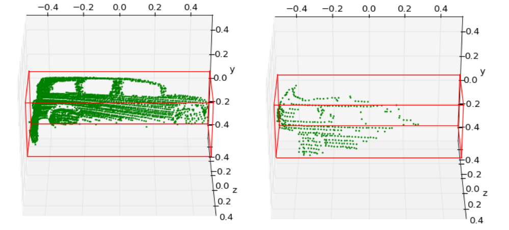

# Getting Started
This repo is aim to extract partial point clouds within labeled 3D bounding
boxes. Currently, the KITTI dataset is supported. 

## Dataset Preparation
*   Please download the official [KITTI 3D object
    detection](http://www.cvlibs.net/datasets/kitti/eval_object.php?obj_benchmark=3d)
    dataset and organize the downloaded files as follows:
    ```
    ├── kitti
    │   │── ImageSets
    │   │── training
    │   │   ├──calib & velodyne & label_2 & image_2
    │   │── testing
    │   │   ├──calib & velodyne & image_2
    │   
    ├── extract_partial_point_clouds_from_kitti.py
    ├── utils.py
    ├── visualize.py
    ├── calibration.py
    ```
    
## Quick Demo
*   Here we provide a quick demo to extract partial point clouds of cars from
    the point clouds saved in the `kitti/training/velodyne/000936.bin`:

    ```shell
    python extract_partial_point_clouds_from_kitti.py \
        --idx 000936 \
        --category car
    ```

    Each individual 3D bounding box and the partial point clouds within it are saved
    in the `output/` with the filename `000936_car_{point or bbox}_0.npy`.

*   Visualization. Take the `000936_car_point_0.npy` for example:
    ```shell
    python visualize.py \
        --idx 000936 \
        --category car
        --i 0
    ```
    <p align="center">
        
    </p> 


## Others
The output points clouds and bounding boxes are tranformed into the coordinate
system of Shapenet `(x->forward, y->up)` from kitti lidar `(x->forward, z->up)`.
If you prefer no such tranformation, comment the following line in the
`extract_partial_point_clouds_from_kitti.py`:

```python
...
box = bboxes[i]
points_canonical, box_canonical = utils.points_to_canonical(p, box)
# points_canonical, box_canonical = utils.lidar_to_shapenet(points_canonical, box_canonical)
pts_name = 'output/{}_{}_point_{}'.format(args.idx, args.category, i)
box_name = 'output/{}_{}_bbox_{}'.format(args.idx, args.category, i)
...

```
